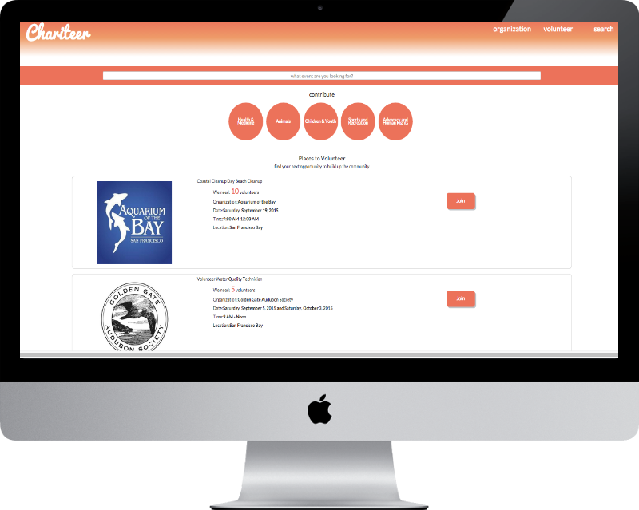
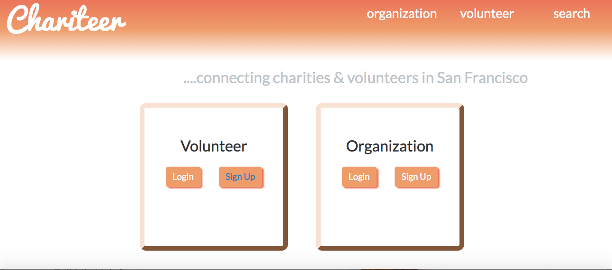
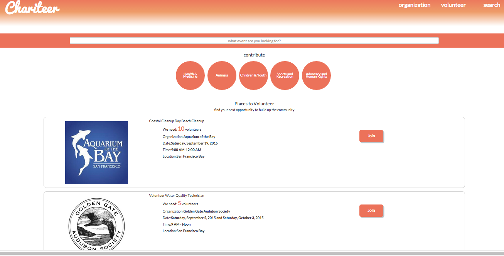
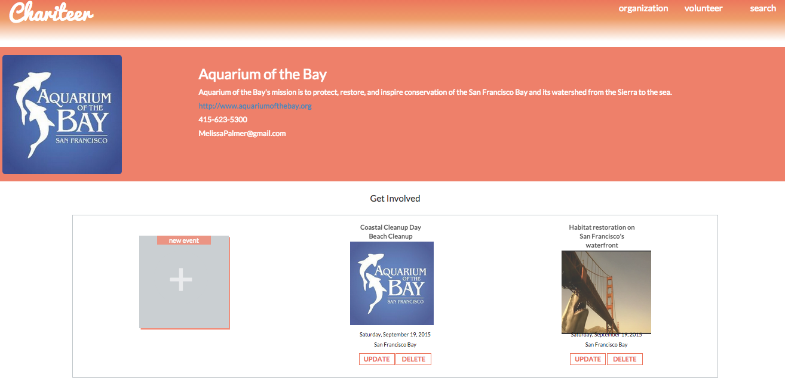
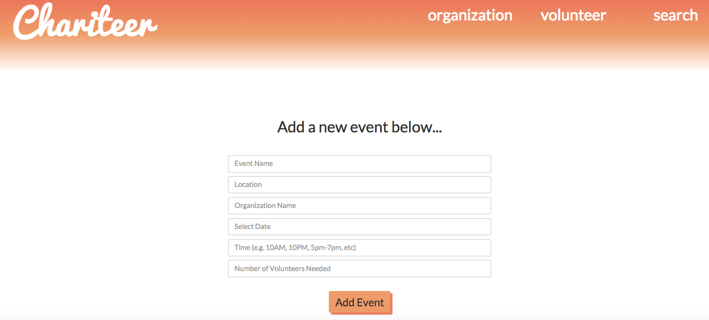
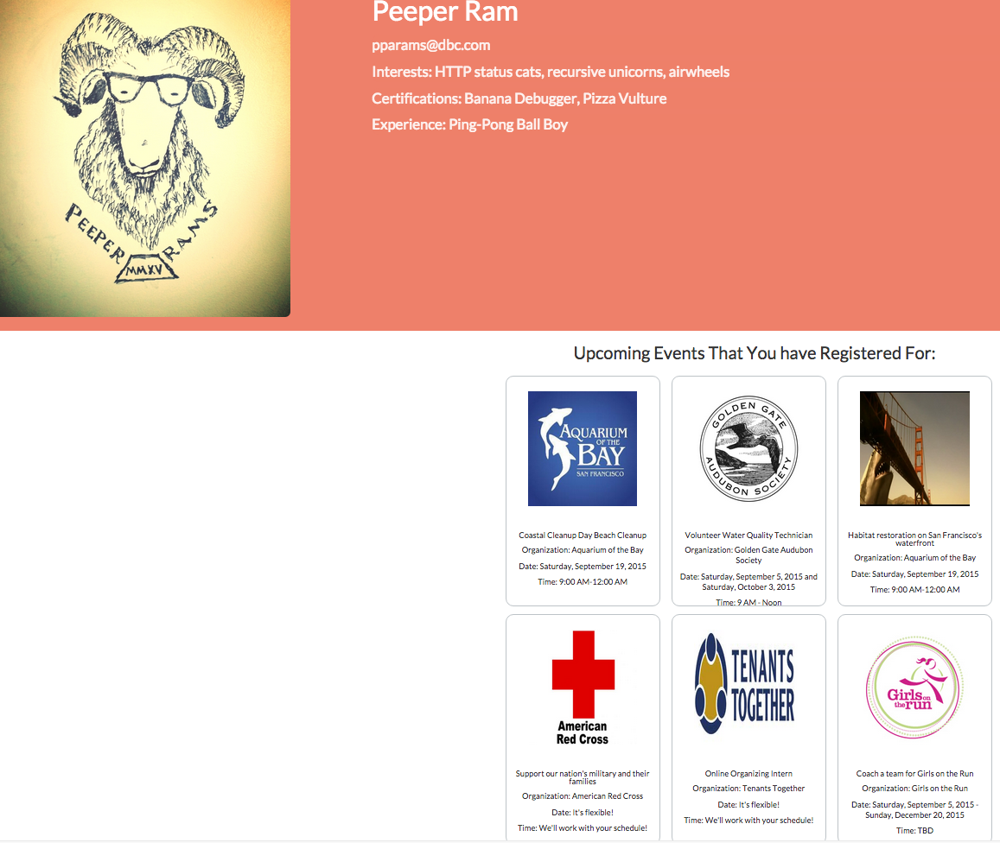

<!-- App Information -->

  

    

      <h1 class="header-title">CHARITEER</h1>
      
Chariteer was created for volunteers and charity organizations to connect to build a better community. Chariteer is a decoupled app that uses Rails API as the backend and AngularJS as the front end.

      My contribution in this team project was to develop the functionalities of the Rails API and the integration from frontend to the backend.
      

      
See the API source code at <a href="https://github.com/gVien/chariteer-api" target="_blank">API side Github</a>!

      
See the Client Side source code at <a href="https://github.com/gVien/chariteer-client-side" target="_blank">Client-Side Github</a>!

    

    

      
    

  

<!-- Video Demo and Accomplishment -->

  

    

      <h3 class="header-title">DEMO</h3>
      <video width="100%" height="100%" poster="../../assets/images/demo-video.png" autoplay loop>
        <source src="images/chariteer-demo.mp4" type="video/mp4">
        Your browser does not support HTML5 video.
      </video>
    

    

      <h3 class="header-title">ACCOMPLISHMENT</h3>
      
We build a decoupled app to connect volunteers with charity organizations.The app has these functionalities:

      
Client side fetches the data (events, organization profile, and volunteer profile) from the API side.

      
A volunteer can create a profile and search for events to volunteer.

      

      
Organization can create a profile and add events.

      

    

  

<!-- Screenshot -->

  

    <h3 class="header-title">SCREENSHOTS (click to enlarge)</h3>
    

    

    

    

    

  

<!-- Technology Used -->
<section id="services" class="add-padding bg-color-light-gray">
  

    <h3 class="header-title">TECH USED</h3>
    

      

        
<i class="fa fa-lightbulb-o"></i>

        <h3>Platform</h3>
        
Web browser

      

      

        
<i class="fa fa-desktop "></i>

        <h3>Front End</h3>
        
Javascript, AngularJS, Responsive Grid, Bootstrap, HTML5/CSS3

      

      

        
<i class="fa fa-space-shuttle"></i>

        <h3>Back End</h3>
        
Rails API, PostgreSQL

      

    

  

</section>

<!-- Team -->

  <h3 class="header-title">TEAM</h3>
  

    
Gai Vien

    
Teresa Nesteby

    
Jaclyn Karnowski

    
Marisa Ramon

  

    
Comments:

<noscript>Please enable JavaScript to view the <a href="http://disqus.com/?ref_noscript">comments powered by Disqus.</a></noscript>
<a href="http://disqus.com" class="dsq-brlink">comments powered by Disqus</a>

