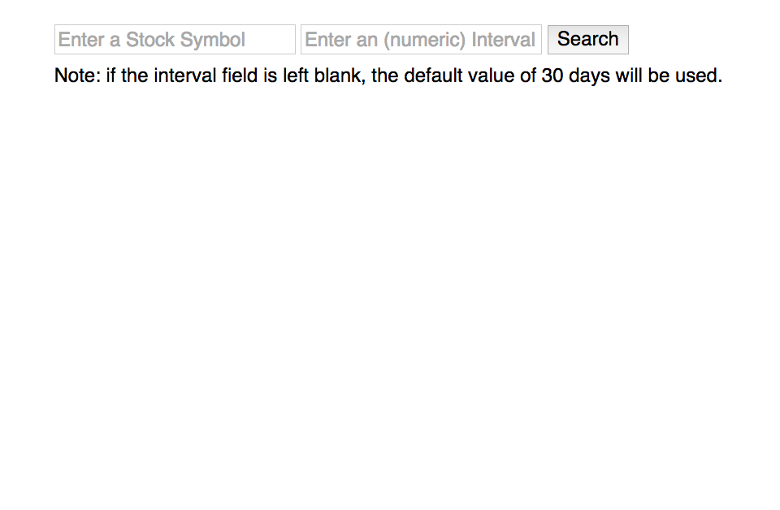
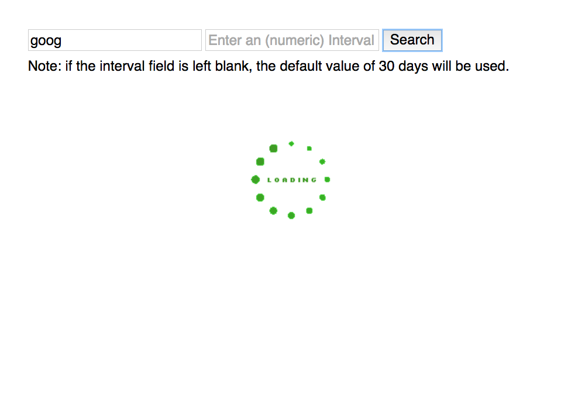
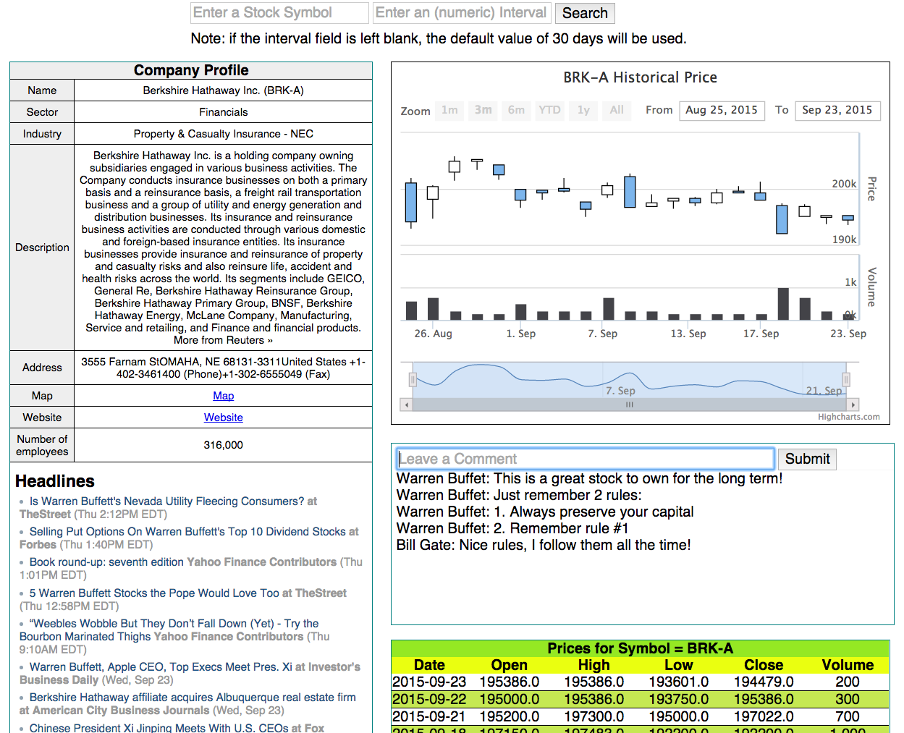

<!-- App Information -->

  

    <h1 class="header-title">Finance-Exchange</h1>
    
Finance-exchange makes it easy to connect and share investing information with traders/investors. It is a financial app that allows an investor or trader to search for any US publicly traded company. Upon entering a stock symbol (such as GOOG, AAPL, TSLA, etc.), the app will provide these important information:
      <ol class="lead">
        <li>Company's profile</li>
        <li>Headlines of the company</li>
        <li>Candlestick chart showing the historical price</li>
        <li>Stock price data table</li>
        <li>Chat Box to share information</li>
      </ol>
  

    
See the source code at <a href="https://github.com/gVien/finance-exchange" target="_">Github!</a>

    
See the full deployment at <a href="http://finance-exchange.herokuapp.com" target="_">Heroku</a>!

  

  

    
  

<!-- Screenshot -->

  <h1 class="header-title">Screenshots (click the image to enlarge)</h1>
  
The search engine for all US public companies: 

  
Searching for a Google Inc... 

  
The results of the search: 

<!-- Technology Used -->
<section id="services" class="add-padding bg-color-light-gray">
  

    <h1 class="section-title big-text">Tech Used</h1>
    

      

        
<i class="fa fa-lightbulb-o"></i>

        <h3>Platform</h3>
        
Web browser

      

      

        
<i class="fa fa-desktop "></i>

        <h3>Front End</h3>
        
Javascript, HighCharts, jQuery, AJAX, HTML/CSS

      

      

        
<i class="fa fa-space-shuttle"></i>

        <h3>Back End</h3>
        
Sinatra/Ruby, PostgreSQL, Yahoo Finance API

      

    

  

</section>

    
Comments:

<noscript>Please enable JavaScript to view the <a href="http://disqus.com/?ref_noscript">comments powered by Disqus.</a></noscript>
<a href="http://disqus.com" class="dsq-brlink">comments powered by Disqus</a>

