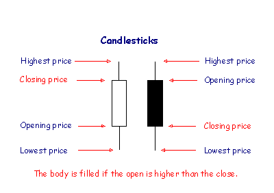

<!-- App Information -->

  

    

      <h1 class="header-title">FINANCIAL CHART</h1>
      
Financial chart lets you create <a href="https://en.wikipedia.org/wiki/Candlestick_chart" target="_blank">candlestick stock charts</a> of any stocks such as Apple's (AAPL), Microsoft's (MSFT), or Facebook's (FB) stock charts. It is not limited to these symbols, you may search for any (US) stock symbols that you are interested in. The stock charts data are pulled from Yahoo Finance API and plotted using data-driven Javascript library, <a href="http://d3js.org/" target="_blank">D3.js</a>. The chart can help technical analysts estimate the future price of a stock.
      

      <!-- 
I learned <a href="http://d3js.org/" target="_blank">D3.js</a>
 -->
      
See the source code at <a href="https://github.com/gVien/financial-charts-with-d3js" target="_blank">Github!</a>

      
See the full deployment at <a href="http://financial-chart.herokuapp.com/" target="_blank">Heroku</a>!

    

    

      
    

  

<!-- Video Demo and Accomplishment -->

  

    

      <h3 class="header-title">DEMO</h3>
      <video width="100%" height="100%" poster="../../assets/images/demo-video.png" autoplay loop>
        <source src="images/financial-chart-screen-cast.mp4" type="video/mp4">
        Your browser does not support HTML5 video.
      </video>
    

    

      <h3 class="header-title">ACCOMPLISHMENT</h3>
      
I learned <a href="http://d3js.org/" target="_blank">D3.js</a> and used it to build a candlestick chart from the ground up and incorporated this technology with Rails, jQuery, Yahoo Finance API, and AJAX within 3 days.

      
We can search for a company name and the auto complete will help us choose the company's stock symbol.

      
The web app can plot the candle stick chart for any number of data specified in the period box.

      
If we enter the wrong symbol, the app will give us a warning that it is not a valid stock symbol.

    

  

<!-- Screenshot -->

  

    <h3 class="header-title">SCREENSHOTS (click to enlarge)</h3>
    

    

    

    

    

  

<!-- Technology Used -->
<section id="services" class="add-padding bg-color-light-gray">
  

    <h3 class="header-title">TECH USED</h3>
    

      

        
<i class="fa fa-lightbulb-o"></i>

        <h3>Platform</h3>
        
Web browser

      

      

        
<i class="fa fa-desktop "></i>

        <h3>Front End</h3>
        
Javascript, D3.js, jQuery, AJAX, HTML/CSS

      

      

        
<i class="fa fa-space-shuttle"></i>

        <h3>Back End</h3>
        
Rails, PostgreSQL, Yahoo Finance API

      

    

  

</section>

    
Comments:

<noscript>Please enable JavaScript to view the <a href="http://disqus.com/?ref_noscript">comments powered by Disqus.</a></noscript>
<a href="http://disqus.com" class="dsq-brlink">comments powered by Disqus</a>

