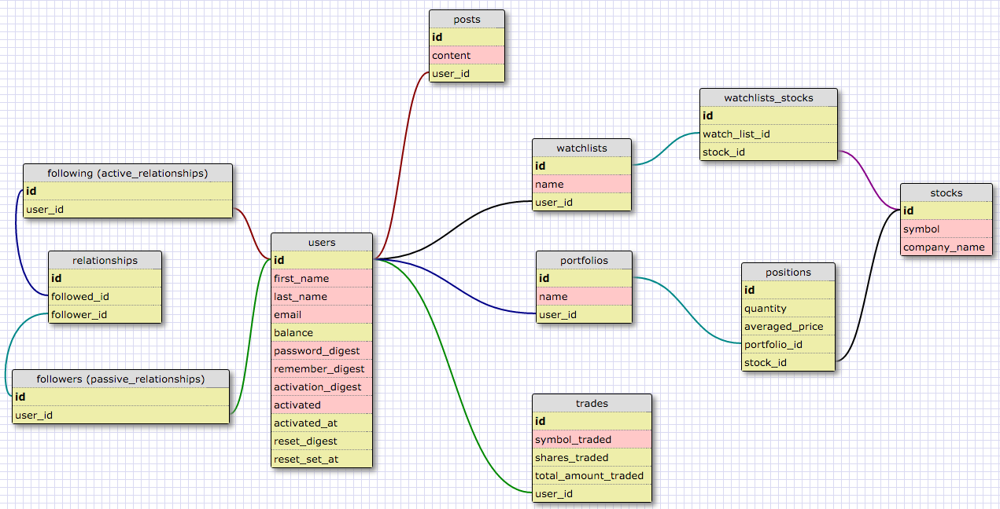
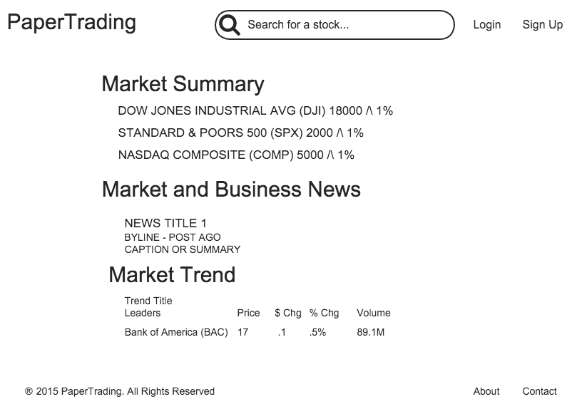
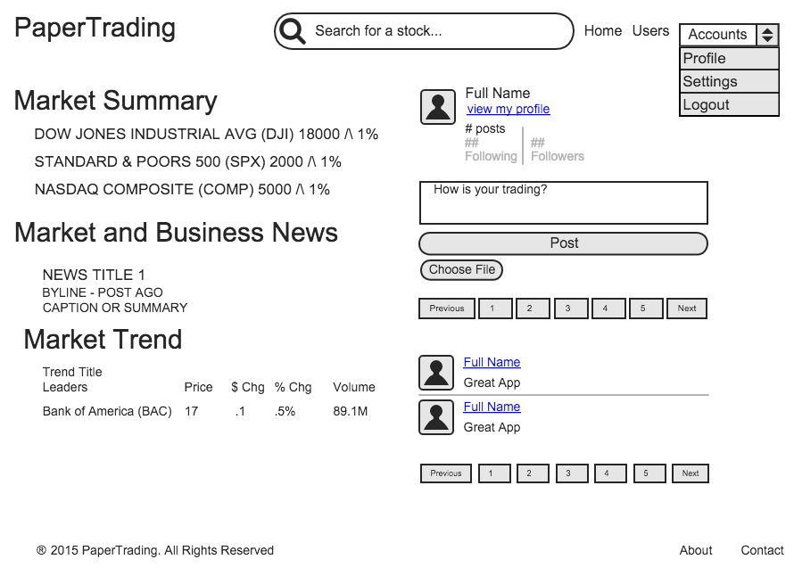
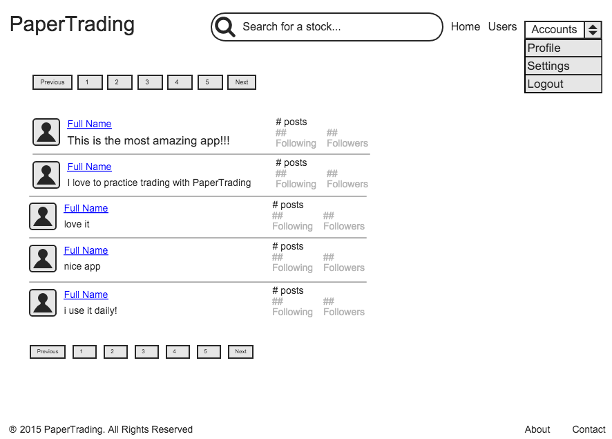
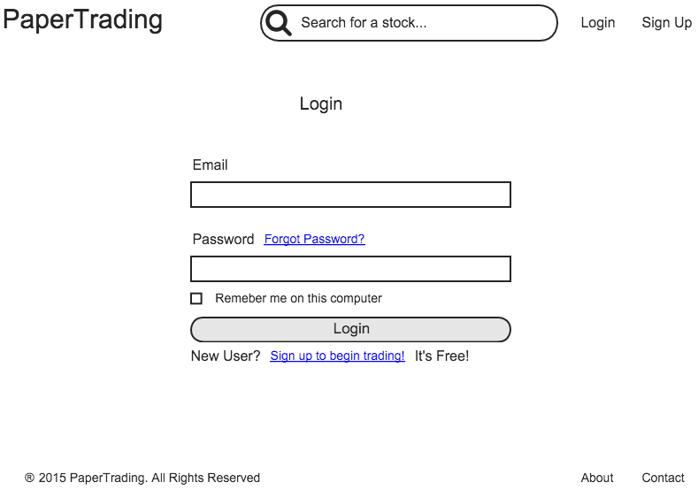
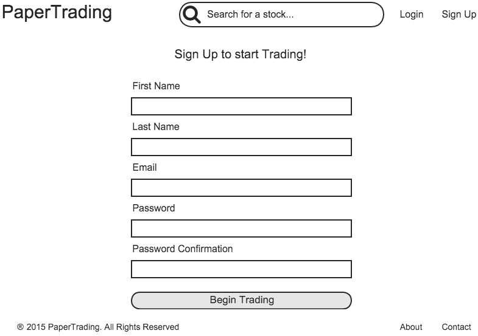
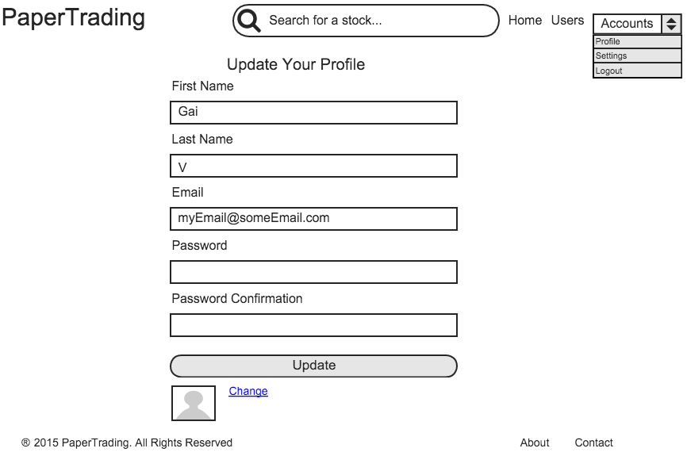
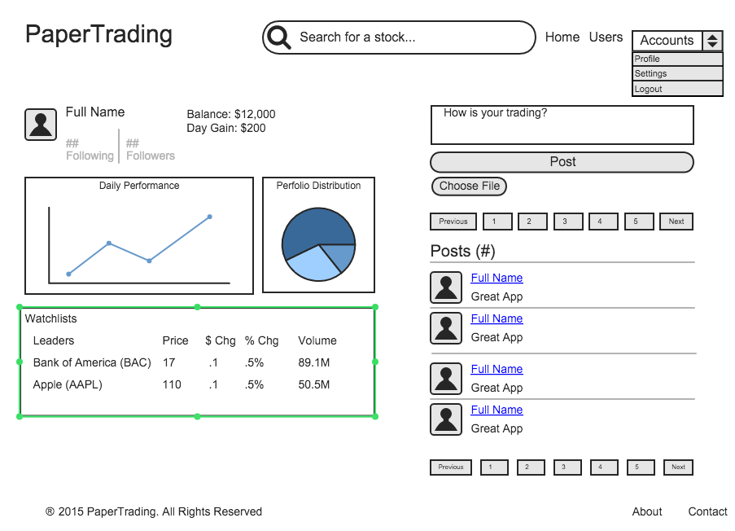

<!-- App Information -->

  

    

      <h1 class="header-title">PaperTrading</h1>
      
PaperTrading is an application that lets people practice trading stocks using real-time financial data; it is a virtual trading platform. The app was created to help people conquer their fear of investing/trading or learning about the financial market without losing their hard earned money. Once they are confident enough, they can surely outperform the market.
      

      
See the source code at <a href="https://github.com/gVien/PaperTrading" target="_blank">Github</a>!

      
The full deployment is on the way but please feel free to check out the wireframes, user stories, and database schema design of this app below!

    

  

<!-- Video Demo and Accomplishment -->

  

    

      <h3 class="header-title">DEMO</h3>
      A demo video is in the work. Of course, when the app is fully deployed, it can also be used as a demo.
    

  

<!-- User Stories -->

  

    <h3 class="header-title">User Stories (features)</h3>
    <ul>
      <li>As a user, I want to be able to log in/log out and sign up.</li>

      <li>As a user, I want to see the market news on the front page and market trends.</li>

      <li>As a user, I want to follow/unfollow a another user.</li>

      <li>As a user, I want to post a status update on my profile page.</li>

      <li>As a user, I want to add images to my status update.</li>

      <li>As a user, I want to see status updates for my posts and posts of other users that I follow on all pages of the website after I log in.</li>

      <li>As a user, I do not want to see posts from other users that I just unfollow.</li>

      <li>As a user, I want to buy a stock listed on the market trends on the front page

      <li>As a user, I want to search for a stock and see the company information.</li>

      <li>As a user, I want to search for a stock and buy it.</li>

      <li>As a user, I want to search for a stock and add to a watch list.</li>

      <li>As a user, I want to see the list of stocks I bought in my portfolio page.</li>

      <li>As a user, I want to see the list of stocks I added to the watchlist.</li>

      <li>As a user, I want to be able to contact the website’s administrator through a contact form.</li>

      <li>As a user, I want to see the about page of the website to learn more.</li>

      <li>As a user, I want to see a list of users who have registered on the website so I can follow.</li>
    </ul>
  

<!-- Screenshot -->

  

    <h3 class="header-title">SCREENSHOTS (click to enlarge)</h3>
    

    

    

    

    

    

    

   

  

<!-- Technology Used -->
<section id="services" class="add-padding bg-color-light-gray">
  

    <h3 class="header-title">TECH USED</h3>
    

      

        
<i class="fa fa-lightbulb-o"></i>

        <h3>Platform</h3>
        
Web browser, mobile friendly

      

      

        
<i class="fa fa-desktop "></i>

        <h3>Front End</h3>
        
Javascript, jQuery, Bootstrap, HTML5, CSS3/Sass

      

      

        
<i class="fa fa-space-shuttle"></i>

        <h3>Back End</h3>
        
Rails, PostgreSQL, TradeKing API, New York Times API, SendGrid API, Amazon Web Services (S3)

      

    

  

</section>

    
Comments:

<noscript>Please enable JavaScript to view the <a href="http://disqus.com/?ref_noscript">comments powered by Disqus.</a></noscript>
<a href="http://disqus.com" class="dsq-brlink">comments powered by Disqus</a>

